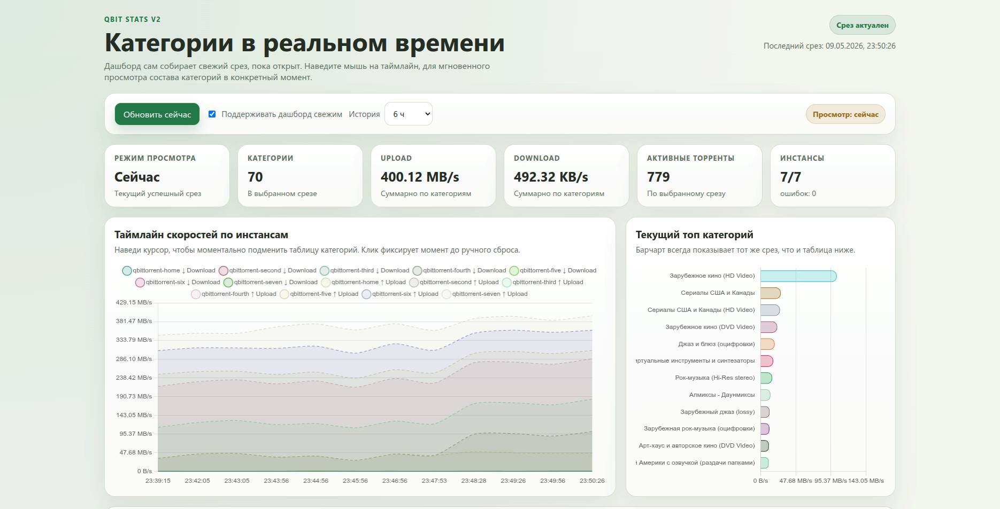

# qBit Stats

Дашборд с приоритетом по категориям для мониторинга нескольких экземпляров qBittorrent.

## Что он делает

- собирает текущую статистику из настроенных экземпляров qBittorrent
- строит живую таблицу категорий и столбчатую диаграмму топ-категорий
- сохраняет историю категорий и скорости в SQLite
- позволяет просматривать состав категории в конкретный момент времени при наведении на таймлайн

## Структура проекта

- `index.php` — интерфейс дашборда
- `update.php` — endpoint для явного обновления через cron или вручную
- `get_current_data.php` — API текущего снимка данных, используемый дашбордом
- `get_history_data.php` — API истории скорости
- `get_category_history.php` — API снимка категорий для выбранной временной метки
- `collector.php` — логика опроса qBittorrent и сохранения данных
- `bootstrap.php` — нормализация конфигурации и инициализация схемы SQLite
- `config.php` — настройки мониторинга и источник списка экземпляров

## Модель обновления

- дашборд может обновлять данные по запросу, когда текущий срез устаревает
- `update.php` также можно вызывать через cron
- оба пути используют одну и ту же проверку устаревания и блокировку, поэтому обновление выполняет тот, кто первым её получает

## Локальные файлы

- рабочие данные хранятся в `qbittorrent_stats.db`
- временный файл блокировки: `qbittorrent_stats.lock`
